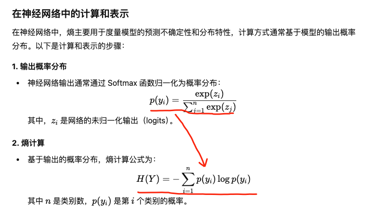
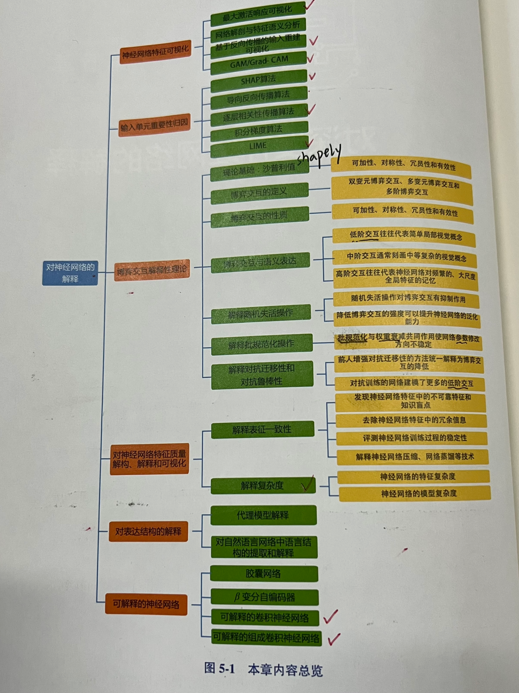

## XAI local-xai

### 现有工具🔧
```bash
[现有工作](https://github.com/stars/LiuJiaji1999/lists/xai)
* scratch_mlp
* lime
* shap
* influence-release
* CV_ImageClassification

1./tensorflow/lucid：https://distill.pub/2017/feature-visualization
    git clone https://github.com/tensorflow/lucid.git
    《Feature Visualization》
2.cnn-explainer：Tiny-VGG网络的特征图表示，Demo: https://poloclub.github.io/cnn-explainer/
    git clone https://github.com/poloclub/cnn-explainer.git
    《CNN Explainer - learning convolutional neural networks with interactive visualization》
3.LLM Visualization：大语言模型的transformer结构表示，
    https://bbycroft.net/llm
```

```bash
conda activate Explan
```

### 模型解释
```text
1. 模型自解释
    ·结构简单的内置可解释性：
        线性回归y=β_0+β_1X_1+…+∈、决策树、贝叶斯P(X,Y)=P(x)P(y|x)等，
        权衡模型准确性和内置可解释性；
    ·注意力机制：可视化输入输出对的注意权重，可增加掩码关注区域视角；
    ·知识数据融合模型：融合先验知识或物理规律的知识图谱；
    ·强化学习的决策性：

2. 建模前解释
    基于数据样本的解释，通过数据预处理，数据挖掘等手段可视化数据分布。
    ·原型：具有代表性的数据实例；批评：代指一类数据，目的是为模型行为提供见解；
    ·影响函数：计算改变一个训练数据之后对模型参数和预测损失的影响有多大，并找出对具体的某个决策影响最大的训练样本。

3. 训练后解释
    ·模型特定方法：聚焦于神经网络模型，常用方法有：
        a.类激活映射CAM：CAM的其他改进版本及论文链接,
            pip install grad-cam==1.4.0 # Grad-CAM 
        b.分层相关性传播：对非线性分类器可视化单个像素对预测结果的贡献。
        c.反向传播：通过BP，在输入得到的各梯度大小反映了对于这张图像网络主要关注的区域。
    ·模型无关方法：聚焦于模型的外特性
        a.局部代理LIME：利用该实例及近邻样本训练的线性回归模型拟合该模型的边界；
        b.博弈论SHAP：反映每个特征对预测的贡献度，与人类认知最为相近; 

对DNN的解释
·神经网络特征可视化
·输入单元重要性归因
    导向反向传播 GBP：
    逐层相关性传播 LRP：
·博弈交互解释性理论
·对神经网络特征质量解构、解释和可视化：表征一致性、特征复杂度、模型复杂度（熵）
    
    ### 熵（Entropy）
    信息论中的核心概念，由克劳德·香农提出，用于度量不确定性或信息量。
    概率分布越均匀，熵越大；越偏向单一值，熵越小。
    👇图1。

·对表达结构的解释
·可解释的神经网络：💊胶囊网络、AE->VAE->beta-VAE、互信息｜核函数（谱聚类）
```




####  因果关系
```bash 
1. https://mp.weixin.qq.com/s/l-I5DtxUU1yU1Ke_P--GWA
```

####  可解释性理论
```bash 
1. https://mp.weixin.qq.com/s/t2LZvKhhCs9epPyLZwN-dw
2. 等变神经网络的可解释 
    《Equivariant neural networks and piecewise linear representation theory》
```